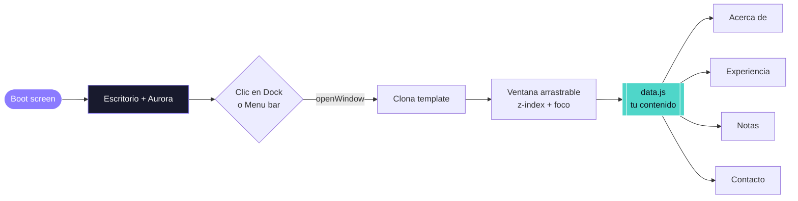

<div align="center">


<a href="https://readme-typing-svg.demolab.com">
  
</a>

<br/><br/>


<br/><br/>

<a href="https://andreamperezp.github.io/portfolio-create/">
  
</a>
<a href="https://linkedin.com/in/andreamariange">
  
</a>
<a href="assets/CV_Andrea_Perez.pdf">
  
</a>

</div>

<br/>

---

## 🖥️ ¿Qué es esto?

**AndreaOS** no es un portfolio que se *lee* — es uno que se **usa**. En vez de una página que
scrolleás, entrás a un **escritorio interactivo** inspirado en un sistema operativo: abrís
ventanas, las arrastrás, explorás una app de **Notas** con lo mejor de mi perfil y accedés a todo
—LinkedIn, GitHub, web, CV— desde un **dock**. Todo con un fondo *aurora* animado y estética
*glassmorphism / frost*.

> 🪶 **Sin librerías, sin frameworks, sin build, sin 3D.** Solo HTML + CSS + JavaScript vanilla.

<br/>

## ✨ Características

<table>
<tr>
<td width="50%" valign="top">

**🎬 Experiencia**
- Pantalla de **boot** animada → escritorio
- Fondo **aurora** con blobs en movimiento
- **Menu bar** con reloj en vivo y estado *"Disponible"*
- Efecto **glass / frost** en todo el sistema

</td>
<td width="50%" valign="top">

**🪟 Interacción real**
- Ventanas que **abren, arrastran, enfocan y cierran**
- Botones tipo **semáforo** (rojo/amarillo/verde)
- **Dock** con magnificación e indicador de app activa
- App de **Notas**: Perfil / Logros / Competencias

</td>
</tr>
</table>

<br/>

## 🏗️ Cómo funciona por dentro

El corazón es un **gestor de ventanas** liviano: cada app es un template HTML que se clona,
se vuelve una ventana arrastrable con su propio `z-index`, y se llena con contenido generado
desde un único archivo de datos.



<br/>

## 🗂️ Estructura del proyecto

<details>
<summary><b>📁 Click para ver el árbol de archivos</b></summary>

```
portfolio-create/
├── index.html          # Estructura + templates de cada ventana
├── css/
│   └── style.css       # Aurora, glass, dock, ventanas, animaciones
├── js/
│   ├── data.js         # ⬅️ TODO tu contenido vive acá (editá esto)
│   └── main.js         # Window manager · dock · boot · reloj
└── assets/
    ├── favicon.svg
    └── CV_Andrea_Perez.pdf
```

</details>

<br/>

## ✏️ Personalizarlo

<details>
<summary><b>💡 Click: cómo cambiar el contenido sin tocar código</b></summary>

<br/>

Todo el texto —perfil, experiencia, skills, logros, contacto y links— vive en un solo lugar:
[`js/data.js`](js/data.js). No hace falta tocar el HTML.

```js
window.ANDREA = {
  meta: {
    name: "Andrea Pérez",
    role: "Directora de Producto y Tecnología",
    tagline: "No hago cosas increíbles. Solo optimizo procesos.",
    // ...email, linkedin, web, cv
  },
  experience: [ /* tus trabajos */ ],
  skills:     [ /* tus competencias */ ],
  highlights: [ /* tus logros */ ],
};
```

Cambiás los valores, guardás, recargás. Listo. 🪄

</details>

<br/>

## ▶️ Correrlo localmente

<details>
<summary><b>🖥️ Click para ver cómo</b></summary>

<br/>

Abrí `index.html` directamente en el navegador, o serví la carpeta:

```bash
npx serve .
```

</details>

<br/>

## 🚀 Deploy

Es un sitio **100% estático**, se publica solo:

| Plataforma | Cómo |
|------------|------|
| **GitHub Pages** | Settings → Pages → Branch `main` / `root` → Save |
| **Vercel** | Import repo → deploy (sin configuración) |
| **Netlify** | Arrastrá la carpeta a netlify.com/drop |

Activo en GitHub Pages queda en: **`https://andreamperezp.github.io/portfolio-create/`**

<br/>

---

<div align="center">

### 💜 Hecho con dedicación

*"No hago cosas increíbles. Solo optimizo procesos."*

<a href="https://linkedin.com/in/andreamariange">LinkedIn</a> ·
<a href="https://github.com/andreamperezp">GitHub</a> ·
<a href="assets/CV_Andrea_Perez.pdf">CV</a>


</div>
